> Technology, curiosity, and a few very specific obsessions.

I'm Marcos. I've spent over 20 years working with technology, systems, and everything that happens behind a screen.

I'm interested in understanding how things work, experimenting with tools, automating tasks, and building small projects that solve actual problems.

Lately, much of that curiosity revolves around artificial intelligence, local models, and new ways of creating software.

I'm not particularly interested in collecting technologies just to make a profile look impressive. I'm more interested in what you can actually do with them.

---

### `01 / INTERESTS`

* **Artificial Intelligence:** local models, agents, LLMs, and experimentation.
* **Self-hosting & Privacy:** control over my tools, my data, and my infrastructure.
* **Automation:** eliminating repetitive tasks because life already has enough of those.
* **Open Source:** learning, modifying, reusing, and sharing.
* **The Old Internet:** personal websites, blogs, independent projects, and the days when every website had its own personality.

### `02 / CURRENTLY EXPLORING`

```text
> Local AI          [ EXPERIMENTING ]
> AI-assisted dev   [ EXPLORING    ]
> Personal tools    [ BUILDING     ]
> Automation        [ ALWAYS       ]
> Old web revival   [ IN PROGRESS  ]
```

### `03 / A LITTLE ABOUT ME`

* IT professional by trade, curious by default.
* More interested in understanding systems than collecting frameworks.
* I appreciate tools that respect your time.
* I prefer autonomy over unnecessary dependencies.
* I like documenting what I learn, even when the result is discovering three new problems.

I also write on my little corner of the Internet:

**[El Camino de Marcos](https://soymarcosba.blogspot.com/)**

A personal archive of thoughts, technology, culture, memories, and other things that probably didn't need to become a project, but here we are.

### `04 / PHILOSOPHY`

```text
Less noise.
More curiosity.

Understand before automating.
Build before depending.
Keep what works.
Question what doesn't.

The Internet was supposed to be interesting.
Let's keep it that way.
```

---

<sub>© @marcosba · Personal experiments, useful tools, and occasional rabbit holes.</sub>
